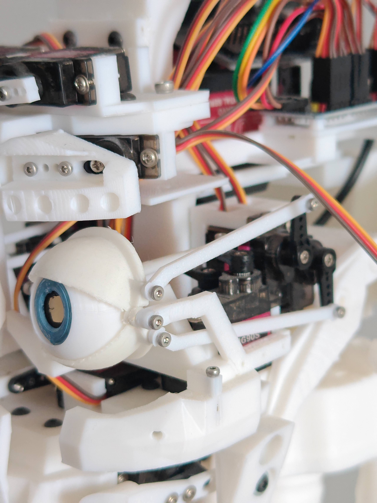

# 🤖 Adam Humanoid Robot — Embodied AI Showcase

  

> **Note:** The core C++ and Python source codes are proprietary. This repository provides a high-level overview of the system architecture, hardware design, and cognitive pipeline.

## 📌 Project Overview
**Adam** is an advanced 3D-printed humanoid robot built from scratch. It integrates edge-computed multithreading with cloud-based generative AI to deliver real-time, low-latency human-robot interaction (HRI). The platform is designed to process multimodal inputs (vision, voice, user history) and translate them into coordinated physical behaviors.

---

## 🧠 Cognitive Architecture (The "Brain")
Adam doesn't just parse text; it understands context and user traits.

* **Dynamic Model Switching:** Leverages Google Gemini, Llama, and Ollama depending on operational requirements and context depth.
* **Episodic Memory Retrieval (RAG):** Uses a localized Retrieval-Augmented Generation pipeline to maintain persistent memory across conversations.
* **Multimodal Perception:** Real-time Facial Landmark Tracking and Voice Activity Detection (VAD) modulate conversational state and physical response.

  

---

## ⚙️ Middleware Layer (Latency Masking)
Cloud-based inference (STT $\rightarrow$ LLM $\rightarrow$ TTS) introduces variable latency (1–3 seconds), which can break conversational naturalness. 

To solve this, I engineered an asynchronous **C++/Python engine** that triggers autonomous micro-behaviors (subtle head tilting, blinking, natural idle sway) while inference is in flight. This successfully masks the cloud processing delay and preserves human engagement.

---

## 🔩 Hardware Layer (Embedded Systems)
Every physical component is designed to safely execute the cognitive layer's commands.

* **Actuation:** 20+ independent servo motors controlling degrees of freedom across the head, neck, arms, and torso.
* **Low-Latency Transport:** Dedicated low-overhead UDP socket pipeline connecting the edge compute board with motor controllers.
* **Firmware Safety:** Custom C++ failsafes enforcing current draw limits, thermal thresholds, and physical angle constraints to prevent mechanical stress.

  
  &nbsp;
  

---

## 📬 Contact
For technical questions, architectural discussions, or collaboration opportunities:
* **Email:** [omerfaruk.kus@outlook.com](mailto:omerfaruk.kus@outlook.com)
* **LinkedIn:** [linkedin.com/in/omrfrkkus](https://linkedin.com/in/omrfrkkus)
