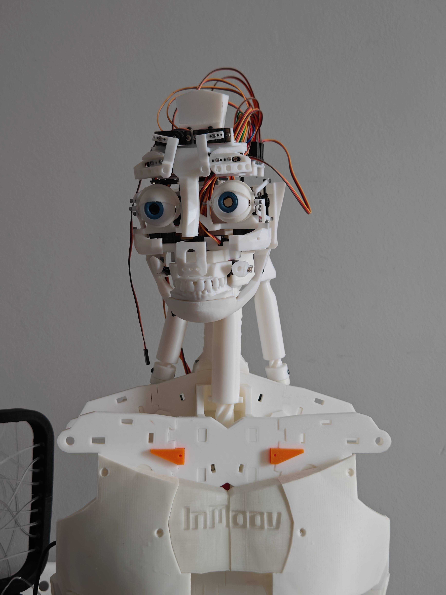
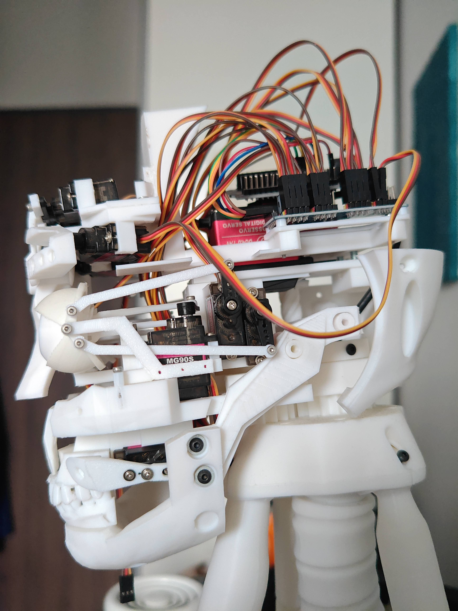

# 🤖 Adam Humanoid Robot — Embodied AI Showcase

> **Note:** The core C++ and Python source codes are proprietary. This repository provides a high-level overview of the system architecture, hardware design, and cognitive pipeline.

---

## 📌 Project Overview
**Adam** is an advanced 3D-printed humanoid robot built from scratch. It integrates edge-computed multithreading with cloud-based generative AI to deliver real-time, low-latency human-robot interaction (HRI). The platform is designed to process multimodal inputs (vision, voice, user history) and translate them into coordinated physical behaviors.

  

---

## 🏗️ System Architecture

### 1. Perception Layer
* **Audio Processing:** Captures real-time audio streams and utilizes Voice Activity Detection (VAD) to identify user prompts.
* **Visual Processing:** Processes camera streams for real-time Facial Landmark Tracking to analyze user presence and traits.

### 2. Cognitive Layer (Cloud & Edge AI)
* **Speech-to-Text (STT):** Converts detected voice activity into text prompts.
* **Context & Memory:** A localized Retrieval-Augmented Generation (RAG) database retrieves past conversation history to build highly personalized prompts.
* **LLM Pipeline:** Routes the structured prompts through Google Gemini, Llama, or Ollama to generate intelligent responses.
* **Text-to-Speech (TTS):** Converts the LLM output back into natural-sounding speech.

### 3. Middleware Layer (C++ & Python)
* **Asynchronous Micro-movements:** Generates autonomous idle animations (breathing, blinking, slight head movements) while the cognitive layer processes data.
* **Motion Dispatcher:** Extracts intent and emotion from the LLM to trigger synchronized, context-aware physical gestures.

### 4. Hardware Layer (Embedded Systems)
* **Communication:** Transmits commands from the middleware to the microcontrollers via a low-latency UDP protocol.
* **Actuation:** Controller firmware safely drives 20+ independent servo motors using PWM signals.

---

## 🧠 Core Engineering Highlights

* **Latency Masking:** Cloud-based inference (STT $\rightarrow$ LLM $\rightarrow$ TTS) introduces variable latency (1–3 seconds), which can break conversational naturalness. An asynchronous C++/Python engine triggers autonomous micro-behaviors while inference is in flight, preserving engagement.
* **Episodic Memory Retrieval:** Uses a localized RAG pipeline to maintain persistent memory across conversations.
* **Firmware Safety:** Custom C++ failsafes enforcing current draw limits, thermal thresholds, and physical angle constraints to prevent mechanical stress.

---

## 📸 Media Gallery

  
  &nbsp;
  

  

---

## 📬 Contact & Technical Discussion
If you are interested in discussing the detailed technical implementation, low-level architecture, or commercial robotics applications:
* **Email:** [omerfaruk.kus@outlook.com](mailto:omerfaruk.kus@outlook.com)
* **LinkedIn:** [linkedin.com/in/omrfrkkus](https://linkedin.com/in/omrfrkkus)
